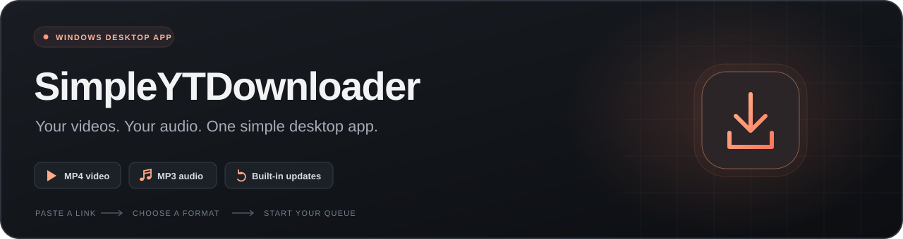

<p align="center">
  
</p>

<h1 align="center">SimpleYTDownloader</h1>

<p align="center">
  <strong>Your next watch. Your favourite audio. Saved your way.</strong><br>
  A Windows desktop app with a custom dark interface, a download queue, and built-in release updates.
</p>

<p align="center">
  <a href="https://github.com/EpicGamer1599/SimpleYTDownloader/releases"><strong>Download for Windows</strong></a>
  &nbsp; · &nbsp;
  <a href="#quick-start">Quick start</a>
  &nbsp; · &nbsp;
  <a href="#application-updates">Updates</a>
  &nbsp; · &nbsp;
  <a href="#build-from-source">Build from source</a>
  &nbsp; · &nbsp;
  <a href="TESTING.md">Test results</a>
</p>

---

## Features

| | What you get |
| :--- | :--- |
| **MP4 video** | Choose a resolution or Best available, with a fallback to the quality the video actually offers. |
| **MP3 audio** | Choose an encoding bitrate or Best available variable-bitrate audio. |
| **Optional thumbnails** | Save a JPEG, PNG, or WebP image beside each MP4 or MP3. Turn it on or off in Settings. |
| **A queue you control** | Add multiple videos, start or pause the queue, cancel items, retry failures, and follow progress. |
| **A clean desktop interface** | A resizable dark Pygame UI with keyboard shortcuts, clipboard support, and a native Windows folder picker. |
| **Six accent themes** | Switch instantly between Orange, Blue, Violet, Mint, Rose, and Gold. Your choice is remembered. |
| **Helpful error dialogs** | See a stable error code, copy a report, or open a prefilled GitHub issue to review and submit. |
| **Readable filenames** | Keep original titles, handle Windows filename rules, and preserve existing files with numbered suffixes. |
| **Remembered preferences** | Save your format, quality, folder, tool paths, and automatic-update preference. |
| **Built-in updates** | Check published GitHub releases, review release notes, and install with progress, backup, and rollback support. |
| **One application EXE** | Run `SimpleYTDownloader.exe` without installing Python, Git, PyInstaller, or development tools. |

## Quick start

1. Open **[Releases](https://github.com/EpicGamer1599/SimpleYTDownloader/releases)** and download the application ZIP asset (for example, `1.0.2.zip` or `SimpleYTDownloader-v1.0.2.zip`).
2. Extract **`SimpleYTDownloader.exe`** into a writable folder and launch it.
3. Paste a video URL on **Download**, choose **MP4** or **MP3**, and select your quality and output folder.
4. Click **Add to Queue**, open **Queue**, and click **Start queue**.

> **Version 1.0.2 build:** [Builds/1.0.2.zip](Builds/1.0.2.zip) contains the application EXE. For users updating from 1.0.0 or the original 1.0.1 build, upload `dist/SimpleYTDownloader-v1.0.2.zip` to the GitHub Release. The [1.0.0](Builds/1.0.0.zip) and [1.0.1](Builds/1.0.1.zip) builds are retained.

See [what changed in 1.0.2](docs/releases/1.0.2.md) for the release notes, or the [1.0.1 features](docs/releases/1.0.1.md).

### Media tools

The EXE includes Python, Pygame, yt-dlp, and its Python dependencies. Media processing tools are detected separately:

| Tool | When it is needed | Setup |
| :--- | :--- | :--- |
| **FFmpeg + FFprobe** | MP3 conversion and merging separate video/audio streams. | Install [FFmpeg](https://ffmpeg.org/download.html#build-windows), then choose its `bin` folder in Settings or add it to PATH. |
| **Deno or Node.js** | Full YouTube support through yt-dlp's JavaScript solver. | Install a supported [Deno](https://deno.com/) or [Node.js](https://nodejs.org/) version. See the [yt-dlp runtime instructions](https://github.com/yt-dlp/yt-dlp/wiki/EJS). |

FFmpeg can also be placed in `tools/ffmpeg/bin/` beside the application, or located through `FFMPEG_LOCATION`. Common Windows WinGet and Kdenlive installations are detected. Without FFmpeg, the app can attempt combined MP4 formats, with potentially limited resolution. The included Python requirements provide yt-dlp's EJS package.

## Make it yours

### Appearance and thumbnails

Open **Settings → Appearance** to choose **Orange, Blue, Violet, Mint, Rose, or Gold**. The accent changes immediately across buttons, selected controls, input highlights, progress indicators, and dialogs. The dark background stays consistent. Keep **Remember settings** enabled to save your choice.

Turn **Settings → Save video thumbnails** on to save an image beside newly queued videos or audio files. The setting is off by default and is captured when each item is added, so retries keep that item's choice. Images use their original JPEG, PNG, or WebP format; they are separate files, not embedded album artwork.

The image normally shares the saved media's filename stem. Existing images are preserved with a numbered suffix when needed. A missing, unsupported, oversized, or unreachable thumbnail produces a reportable warning while keeping the successfully downloaded media. Thumbnail transfers run inside the download worker, so queue cancellation and shutdown stop them as well. Each image is limited to 12 MiB, with up to three metadata-provided candidates attempted.

### Error reports

Download failures, thumbnail failures, input/settings errors, and manual update errors open a dialog with an error code such as `SYTD-NETWORK` or `SYTD-FFMPEG`. Choose **Close**, **Copy report**, or **Report on GitHub**. Error details can also be reopened from the queue. Repeated identical pending reports are grouped, and the queue can continue processing while a dialog is open.

**Report on GitHub** opens a draft at [this project's Issues page](https://github.com/EpicGamer1599/SimpleYTDownloader/issues) with the app version, code, action, OS, error message, and reproduction template filled in. The app removes common local paths, links, and credential fields from the draft. Review the report and add reproduction steps before submitting; opening a draft does not submit an issue automatically. GitHub may ask you to sign in. If the browser cannot open, copy the report and paste it into a new issue manually.

Automatic update checks at startup remain quiet when the connection fails. Unexpected startup/GUI failures have a fallback Windows prompt offering a report link. The repository includes a [bug report template](.github/ISSUE_TEMPLATE/bug_report.md) for issues opened directly on GitHub. Prefilled links use GitHub's documented [issue URL parameters](https://docs.github.com/en/issues/tracking-your-work-with-issues/using-issues/creating-an-issue).

### Download and queue controls

| Action | Behaviour |
| :--- | :--- |
| **Add to Queue** | Adds a video without starting an idle queue by default. Settings can enable automatic start. |
| **Start / Resume queue** | Downloads queued items one at a time. |
| **Pause queue** | Lets the current download and conversion finish, then holds the remaining items. An explicit pause also holds newly added items. |
| **Cancel / Retry** | Stops an item, including its converter, or requeues a failed/cancelled item. |
| **Remove / Clear completed** | Removes queue entries while keeping saved media. |
| **Folder** | Opens an item's output folder. |

Titles and available quality are fetched when an item starts. Waiting entries initially show their video identifier. The queue displays transfer progress, speed, ETA, conversion status, completion, and errors. Queue history lasts for the current session.

<details>
<summary><strong>Quality choices and supported links</strong></summary>

The app accepts public individual video links, including YouTube watch URLs, short links, Shorts, embeds, and archived live-video links. A video URL containing playlist parameters downloads that video only. Playlist downloads, authentication/cookie management, and recording a broadcast while it is still live are outside the current scope.

Resolution is a preference, not a guarantee. The downloader prefers available MP4 video and M4A/AAC audio at or below the selected resolution, with a fallback when necessary. **Best available** does not upscale video. Very high resolutions may use newer codecs, depending on the formats YouTube supplies. MP3 bitrate changes encoding; it does not improve the original source's fidelity.

Private, removed, restricted, throttled, or verification-required videos produce an in-app error that can be copied.

</details>

<details>
<summary><strong>Files, preferences, and keyboard shortcuts</strong></summary>

- Original titles become readable filenames, preserving spaces and supported punctuation. Invalid Windows characters, reserved device names, trailing dots/spaces, empty titles, and long UTF-16 filenames are handled.
- Existing files are preserved: repeated titles receive suffixes such as `My video (2).mp4`.
- Downloads use their own `.ytd-...` temporary directory within the output folder. It is cleaned after success, failure, or cancellation; only completed media is published to the final filename.
- Preferences use the existing compatibility path `%APPDATA%\YouTube Downloader\settings.json`. `YTD_CONFIG_DIR` can change the base configuration folder for portable use or tests. No registry entries are used.
- **Remember settings: OFF** removes saved preferences and keeps subsequent changes in memory only.
- Browse selections on Download save immediately. In Settings, **Save preferences** applies edited folder/tool paths. Format, quality, and toggle changes save automatically; download defaults apply on the next launch.

| Shortcut | Action |
| :--- | :--- |
| `Ctrl+V` / `Ctrl+A` | Paste / select all in a text field. |
| `Ctrl+C` / `Ctrl+X` | Copy / cut selected text. |
| `Shift` + arrow keys | Extend a text selection. |
| `Home` / `End` | Move to the start / end of a text field. |
| `Tab` / `Shift+Tab` | Move between visible controls. |
| `Enter` | Add a focused URL to the queue, or activate the focused button. |
| `Space` | Activate a focused button. |
| Mouse wheel / `Page Up` / `Page Down` | Scroll the queue or shorter-window pages; page keys apply outside text fields. |
| `Escape` | Dismiss a message, clear focus, or choose Later in the update prompt. |

</details>

## Application updates

SimpleYTDownloader checks for updates in the background after its first GUI frame. It checks only the latest published, stable release from **[EpicGamer1599/SimpleYTDownloader](https://github.com/EpicGamer1599/SimpleYTDownloader/releases)** and compares its semantic version with `APP_VERSION`.

| When… | The app… |
| :--- | :--- |
| A compatible newer release is available | Shows your current version, the new version, release name, and scrollable release notes. Choose **Update Now** or **Later**. |
| You choose **Update Now** | Downloads, verifies, and extracts the update in the background, shows progress, then restarts to install it. |
| You want to check manually | Open **Settings → Check for Updates**, even with automatic checks disabled. |
| You prefer to check yourself | Turn **Check automatically at startup** off. Keep **Remember settings** on to retain the preference. |
| You are offline, GitHub is unavailable, or no newer release exists | Continues normal startup. Failed automatic checks do not open an error popup. |

Finish or cancel waiting/active queue items before installing an update. **Cancel** remains available during download, extraction, and preparation; the final handoff/restart cannot be cancelled. Network operations use a 10-second socket timeout, so cancellation of a stalled request can take a moment while the GUI continues rendering.

Only published stable releases qualify. Commits, tags without a published release, drafts, prereleases, GitHub's generated source ZIPs, and equal/older versions do not trigger an installation. Source checkouts can check releases and display their details; automatic installation requires the packaged Windows EXE in a writable folder.

Starting with **1.0.2**, the checker reads the release's actual attached assets and accepts a single ZIP regardless of its filename, including `1.0.3.zip`. If several ZIPs are attached, it prefers the unique `SimpleYTDownloader-vX.Y.Z.zip`; otherwise it reports the ambiguity. The release description is shown as notes, including when an asset check fails. Links in descriptions are never used as executable download sources. A manual asset error opens a reportable popup; closing it reveals the release details and the reason installation is unavailable.

<details>
<summary><strong>Verification, installation, and rollback</strong></summary>

1. **Verify the source.** The URL is reconstructed from the expected repository, release tag, and exact asset filename. Only HTTPS redirects to GitHub's release asset hosts are allowed.
2. **Verify the download.** The byte count and GitHub-provided SHA-256 digest must match. ZIP checks reject traversal, extra files, links, encryption, invalid executables, and mismatched processor architectures. Limits are 256 MiB compressed, 512 MiB extracted, and a compression ratio of 250.
3. **Prepare the helper.** Files are staged in `%TEMP%\SimpleYTDownloader-update-*`. A copy of the **current EXE** runs as `update-helper.exe` with its bundled Python environment. A Windows mutex prevents competing helpers for the same installation in the same session.
4. **Wait and replace.** The helper verifies the original process and handoff token, waits for the app to exit, and copies the candidate onto the installation volume. The existing EXE becomes `SimpleYTDownloader.exe.backup-<token>` before replacement.
5. **Confirm or recover.** The new app must render its first GUI frame and acknowledge the expected version. If replacement or startup fails, the helper moves any failed candidate to `.failed-<token>`, restores the backup, and launches the previous version.
6. **Clean up.** After successful startup or rollback, the restarted app waits for the helper to exit and removes transaction files. Preferences and downloaded media keep their existing locations; in-memory queue history is not retained across the restart.

No separately distributed helper, Python installation, or development tool is required. The build and test scripts do not publish releases.

</details>

<details>
<summary><strong>Update limits and recovery notes</strong></summary>

The updater needs write permission beside the installed EXE and does not request elevation. Another running copy, antivirus locks, or a disk failure can prevent replacement or recovery. If Windows blocks rollback, the original backup is kept and its path is reported for manual recovery.

Abrupt power loss is not automatically recovered on the next launch. A preserved `.backup-<token>` can be restored manually while all app instances are closed. Cleanup retries temporary locks, but files can remain if the new app closes immediately or the OS keeps them locked. Startup acknowledgement checks the first frame and version, not every subsequent application operation.

HTTPS and the API-provided SHA-256 digest protect provenance and transfer integrity within the trusted repository. They are not independent publisher code signing; repository/release access remains the publisher's trust boundary.

Previously distributed builds without an updater require one manual installation of an updater-enabled build. Future releases must retain this project's helper/startup protocol for acknowledgement and rollback.

Implementation references: [GitHub Releases API](https://docs.github.com/en/rest/releases/releases?apiVersion=2022-11-28#get-the-latest-release) · [PyInstaller subprocess environment guidance](https://pyinstaller.org/en/stable/common-issues-and-pitfalls.html#using-sys-executable-to-spawn-subprocesses-that-outlive-the-application-process-implementing-application-restart).

</details>

## Build from source

For development, install **Python 3.10 or newer**, open a terminal in the project folder, and run:

```powershell
py -3 -m venv .venv
.\.venv\Scripts\python.exe -m pip install -r requirements.txt
.\.venv\Scripts\python.exe main.py
```

If the project environment already exists, launch directly with the final command. The main entry point is **`main.py`**. The existing [Launch YouTube Downloader.bat](Launch%20YouTube%20Downloader.bat) is an optional convenience launcher for SimpleYTDownloader.

### Build the one-file Windows EXE

```powershell
.\.venv\Scripts\python.exe -m pip install -r requirements-build.txt
.\.venv\Scripts\Activate.ps1
python -m PyInstaller --onefile --windowed --name SimpleYTDownloader main.py
```

**Output:** `dist/SimpleYTDownloader.exe`

The build includes the GUI, yt-dlp, Python dependencies, download worker, native folder picker, and updater through normal imports. No additional hidden imports or separately distributed updater are required. The EXE opens without a console. FFmpeg/FFprobe and a JavaScript runtime remain separate media tools; portable FFmpeg can be placed under `dist/tools/ffmpeg/bin/`.

<details>
<summary><strong>Refresh yt-dlp in a source environment</strong></summary>

If YouTube changes cause extraction errors, update yt-dlp in the project environment, test, and rebuild for EXE distribution:

```powershell
.\.venv\Scripts\python.exe -m pip install --upgrade "yt-dlp[default]"
```

</details>

## Publish a release

The application version has one source of truth: **[app_version.py](app_version.py)**.

```python
APP_VERSION = "1.0.2"
```

For the next release, set a strictly higher stable semantic version, then follow these steps:

1. **Build on Windows.** Use the command above, keep the name `SimpleYTDownloader.exe`, and match the processor architecture of the installed version.
2. **Package the built EXE.** Run the following from the repository root:

   ```powershell
   .\.venv\Scripts\python.exe -m scripts.package_release
   ```

   The script checks the EXE's `--version` against `APP_VERSION` and verifies the ZIP. It refuses to overwrite an existing release ZIP; move or remove a previous generated archive before deliberately repackaging the same version.

3. **Create a GitHub Release.** Open **[Releases](https://github.com/EpicGamer1599/SimpleYTDownloader/releases) → Draft a new release**, select/create the matching tag, add a name and release notes, and upload the ZIP. Publish it as the latest stable release with prerelease unchecked.
4. **Check the metadata.** Verify the [latest-release API response](https://api.github.com/repos/EpicGamer1599/SimpleYTDownloader/releases/latest). The tag, asset name, repository URLs, size, and `digest` must match. GitHub supplies `digest` as `sha256:...` for newly uploaded assets. Assets without it are rejected; re-upload an older asset if necessary.

| Application version | GitHub release tag (with or without `v`) | Recommended asset, required by old clients |
| :--- | :--- | :--- |
| `1.0.0` | `v1.0.0` | `SimpleYTDownloader-v1.0.0.zip` |
| `1.0.1` | `v1.0.1` | `SimpleYTDownloader-v1.0.1.zip` |
| `1.0.2` | `v1.0.2` | `SimpleYTDownloader-v1.0.2.zip` |
| `1.1.0` | `v1.1.0` | `SimpleYTDownloader-v1.1.0.zip` |

**Compatibility with installed 1.0.0 / original 1.0.1:** those EXEs still require the standard filename above. Publish the 1.0.2 bridge release with `SimpleYTDownloader-v1.0.2.zip` so they can receive this fix, or let users manually extract `Builds/1.0.2.zip`. Changing source code or release descriptions cannot change the updater inside an already installed EXE. Once users run 1.0.2, a future release with just `1.0.3.zip` works too. Keeping the standard name on future releases also supports users who skip versions.

The ZIP must contain **exactly one file at its root**:

```text
SimpleYTDownloader-v1.0.2.zip
└── SimpleYTDownloader.exe
```

Do not include an enclosing folder, helper EXE, DLLs, media tools, or source files. A tag alone, GitHub's generated source archive, or a ZIP committed under `Builds/` will not trigger an update.

## Verification

Run these in a normal interactive Windows session; GUI tests open real windows and exercise the clipboard and native folder dialog:

```powershell
# Application, media, GUI, and updater tests
.\.venv\Scripts\python.exe -m unittest discover -s tests -v

# After building: real EXE media worker and native folder picker
.\.venv\Scripts\python.exe -m tests.executable_smoke

# Real frozen helper: success, cancellation, and rollback on disposable copies
.\.venv\Scripts\python.exe -m tests.updater_executable_smoke
```

Media tests use generated fixtures served over loopback and require FFmpeg/FFprobe. Updater tests use controlled API responses and archives; packaged updater tests replace only disposable EXE copies. These suites do not perform a production update or contact YouTube. The packaged updater report is saved to `test-artifacts/updater-executable-report.json`.

<details>
<summary><strong>Optional GUI screenshot and live YouTube test</strong></summary>

```powershell
# Open the real GUI, capture it, and exit
.\.venv\Scripts\python.exe main.py --smoke-test 3 --screenshot test-artifacts\download.png

# Download the short public video "Me at the zoo" in MP4 and MP3
.\.venv\Scripts\python.exe -m tests.youtube_smoke
```

The live test measures GUI responsiveness and saves its media, screenshot, and JSON report under `test-artifacts/youtube/`.

</details>

See **[TESTING.md](TESTING.md)** for recorded results, environment details, and testing limitations.

## Project map

```text
SimpleYTDownloader/
├── main.py                    App entry point and bundled helper modes
├── app_version.py             Single APP_VERSION constant
├── error_reporting.py         Stable error codes and redacted issue drafts
├── update_checker.py          Published releases, SemVer, verified downloads
├── update_service.py          Background checks, progress, cancellation
├── updater.py                 Staging, Windows helper, backup, rollback
├── runtime.py                 Source/frozen commands and windowed streams
├── config/
│   ├── settings.py            Validated JSON preferences
│   └── themes.py              Six dark-interface accent palettes
├── downloader/
│   ├── models.py              Queue item data
│   ├── manager.py             Sequential queue and worker supervision
│   ├── worker.py              yt-dlp downloads and FFmpeg postprocessing
│   ├── thumbnails.py          Optional bounded image downloads
│   ├── process.py             Windows Job Objects and process cleanup
│   ├── utils.py               URL/path validation and safe filenames
│   └── dependencies.py        Media tool detection
├── ui/
│   ├── app.py                 Pages, layout, input, and main loop
│   ├── update_dialog.py       Release notes and update progress
│   ├── error_dialog.py        Error details, copying, and GitHub reports
│   ├── widgets.py             Drawing, icons, controls, and text fields
│   └── native.py              Windows folder picker and clipboard
├── scripts/
│   └── package_release.py     Version-checked release ZIP creation
└── tests/                     Unit, GUI, media, and packaged EXE checks
```

Downloads and conversion run in a separate process supervised by a background thread. The GUI reads protected snapshots; workers never draw or modify Pygame objects. Update checks/downloads run in their own background thread, and the folder picker runs separately to keep progress responsive.

---

<p align="center">
  <strong>SimpleYTDownloader</strong><br>
  Built with <a href="https://www.pygame.org/">Pygame</a>, <a href="https://github.com/yt-dlp/yt-dlp#embedding-yt-dlp">yt-dlp</a>, and <a href="https://ffmpeg.org/">FFmpeg</a>.<br>
  <a href="https://github.com/EpicGamer1599/SimpleYTDownloader/releases">Releases</a>
  &nbsp; · &nbsp;
  <a href="https://github.com/EpicGamer1599/SimpleYTDownloader/issues">Report an issue</a>
</p>
