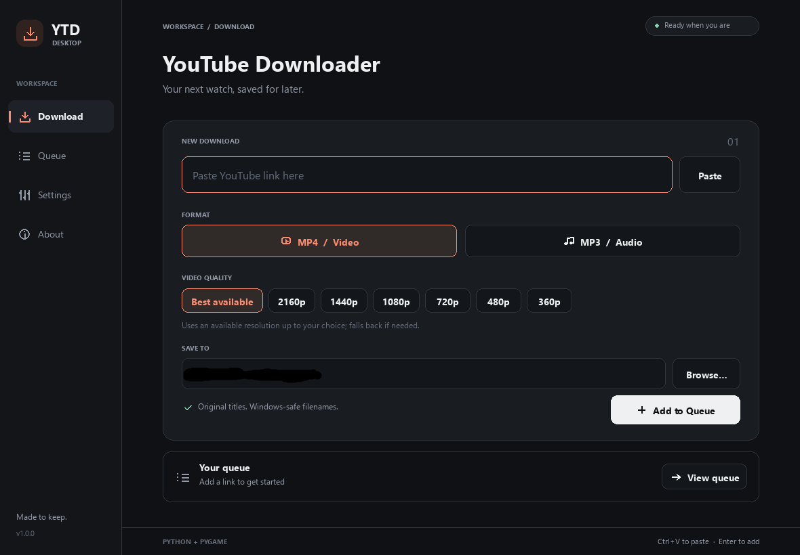

# YouTube Downloader

A working Windows desktop downloader built with Python, a custom Pygame interface, yt-dlp, and FFmpeg.



## Launch on this computer

Double-click **Launch YouTube Downloader.bat**, or run this from the project folder:

```powershell
.\.venv\Scripts\python.exe main.py
```

The project environment has been installed and tested. The app detects the existing FFmpeg and Node.js installations on this computer. The Python entry point is **main.py**; the batch file is an optional convenience launcher.

## Build a Windows executable

Install the build requirements in the project environment, activate it, and run:

```powershell
.\.venv\Scripts\python.exe -m pip install -r requirements-build.txt
.\.venv\Scripts\Activate.ps1
python -m PyInstaller --onefile --windowed --name SimpleYTDownloader main.py
```

The resulting app is **dist/SimpleYTDownloader.exe**. It includes Python, Pygame, yt-dlp, and the Python dependencies, and runs without a console window. FFmpeg/FFprobe and a supported JavaScript runtime are detected separately as described below. To distribute portable FFmpeg tools alongside the executable, use `dist/tools/ffmpeg/bin/`.

The executable includes dedicated worker and folder-picker entry points so these features continue to work without an installed Python interpreter. To verify the packaged media pipeline and folder picker after rebuilding:

```powershell
.\.venv\Scripts\python.exe -m tests.executable_smoke
```

## Set up another Windows computer

Install Python 3.10 or newer from [python.org](https://www.python.org/downloads/windows/), then run:

```powershell
py -3 -m venv .venv
.\.venv\Scripts\python.exe -m pip install -r requirements.txt
.\.venv\Scripts\python.exe main.py
```

Install [FFmpeg and FFprobe](https://ffmpeg.org/download.html#build-windows). You can put their `bin` folder on PATH, put the binaries in `tools/ffmpeg/bin/`, set `FFMPEG_LOCATION`, or select the bin folder in Settings. Common Windows WinGet and Kdenlive installations are also detected. FFmpeg is required for MP3 conversion and separate video/audio streams. Without it, the app can attempt combined MP4 formats, which may have limited resolution.

For full YouTube support, install a supported JavaScript runtime such as [Deno](https://deno.com/) or [Node.js](https://nodejs.org/). The app detects either one, including common Windows install locations. The Python requirements include yt-dlp's EJS package. See [yt-dlp's JavaScript runtime instructions](https://github.com/yt-dlp/yt-dlp/wiki/EJS) for the supported runtime versions.

If YouTube changes cause extraction errors, update the downloader in the project environment:

```powershell
.\.venv\Scripts\python.exe -m pip install --upgrade "yt-dlp[default]"
```

## Use the app

1. Paste a YouTube video URL on **Download**. Watch, short-link, Shorts, embed, and archived live-video links are accepted. A video URL with playlist parameters downloads that video only.
2. Select **MP4** and a resolution, or **MP3** and an encoding bitrate.
3. Choose an output folder and click **Add to Queue**. Enter also adds the link while the URL field is focused.
4. Open **Queue** and click **Start queue**.

The queue downloads one item at a time. Titles and available quality are fetched when an item starts. Waiting items show their video identifier until their title is known. Progress, stream transfer speed, ETA, conversion status, errors, and completion appear in the queue.

**Pause queue** allows the current download and conversion to finish, then holds the remaining items. **Resume queue** continues. **Cancel** stops an active download, including its converter; **Retry** requeues failed or cancelled items. **Remove** and **Clear completed** remove queue entries without deleting saved media. **Folder** opens an item's output folder.

By default, adding a link never starts an idle queue. Settings can enable automatic start. An explicit pause holds new items too, until you resume. Queue history lasts for the current session.

Resolution choices are preferences, not guarantees. The downloader prefers an available MP4 video and M4A/AAC audio at or below the selected resolution, with a fallback when needed. The queue shows the selected video's actual resolution. Selecting Best available does not upscale. Very high resolutions may use newer video codecs depending on YouTube's available formats. MP3 bitrate controls encoding; it does not improve the original source's fidelity. Best available MP3 uses FFmpeg's best variable-bitrate setting.

## Files and settings

- Original titles become readable filenames, preserving spaces and supported punctuation.
- Invalid Windows characters, device names, empty titles, trailing dots/spaces, and long UTF-16 filenames are handled.
- Existing files are preserved. Repeated titles get suffixes such as `My video (2).mp4`.
- Each download uses its own `.ytd-...` temporary directory within the output folder. It is cleaned after success, failure, or cancellation. Only completed media is published to the final filename.
- Preferences are stored in `%APPDATA%\YouTube Downloader\settings.json`. No registry entries are used. `YTD_CONFIG_DIR` can change the base configuration folder for portable use or tests.
- **Remember settings: OFF** deletes the app's saved preferences and keeps future changes in memory only.
- Browse selections on Download are remembered immediately. On Settings, use **Save preferences** to apply edited folder/tool paths; format, quality, and toggle changes save automatically. Defaults apply to the Download page on the next launch.

Text fields support Ctrl+V, Ctrl+A, Ctrl+C, Ctrl+X, selection with Shift+arrows, Home/End, and deletion. Tab/Shift+Tab move between visible controls; Enter/Space activate buttons. The mouse wheel scrolls the queue and short-window pages. Page Up/Down scroll when a text field is not focused. Escape dismisses messages and clears focus.

The app supports public individual videos. Playlist downloads, authentication/cookie management, and recording a broadcast while it is still live are outside the current scope. Private, removed, restricted, throttled, and verification-required videos produce an in-app error that can be copied.

## Code layout

```text
main.py                   Python entry point and missing-dependency message
config/settings.py        Validated JSON preferences
downloader/models.py      Queue item data
downloader/manager.py     Thread-safe sequential queue and worker supervision
downloader/worker.py      yt-dlp extraction, downloading, FFmpeg postprocessing
downloader/process.py     Windows Job Objects and child-process cleanup
downloader/utils.py       URL/path validation and safe final filenames
downloader/dependencies.py Tool detection
ui/app.py                 Main loop, pages, layout, interactions
ui/widgets.py             Custom drawing, icons, buttons, text inputs
ui/native.py              Native Windows folder picker and clipboard
tests/                    Unit, GUI, process-lifecycle, and real-media checks
```

Network work and conversion run in a separate Python process, supervised by a background thread. The GUI reads protected snapshots; workers never draw or modify Pygame objects. Windows Job Objects stop child processes during cancellation and shutdown. A folder picker runs separately so progress can continue updating while it is open.

## Verify

The automated suite uses standard-library `unittest`. GUI checks open real windows and briefly test the clipboard and native folder dialog. Run it in a normal interactive Windows session:

```powershell
.\.venv\Scripts\python.exe -m unittest discover -s tests -v
```

Media tests generate a short local fixture and serve it on loopback to exercise actual yt-dlp downloading, MP4 merging, and MP3 encoding. FFmpeg and FFprobe must be installed; these tests do not contact YouTube.

A short launch test:

```powershell
.\.venv\Scripts\python.exe main.py --smoke-test 3 --screenshot test-artifacts\download.png
```

An optional live test downloads the short public video *Me at the zoo* in both formats, measures GUI responsiveness, and saves the files and JSON report under `test-artifacts/youtube/`:

```powershell
.\.venv\Scripts\python.exe -m tests.youtube_smoke
```

See [TESTING.md](TESTING.md) for the results from this computer. Implementation follows the [yt-dlp Python integration and format selection documentation](https://github.com/yt-dlp/yt-dlp#embedding-yt-dlp).
